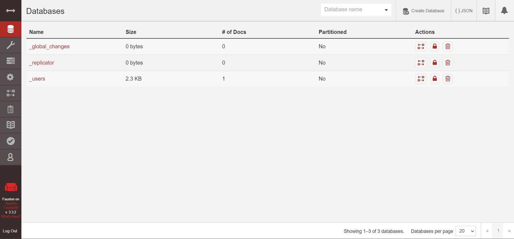
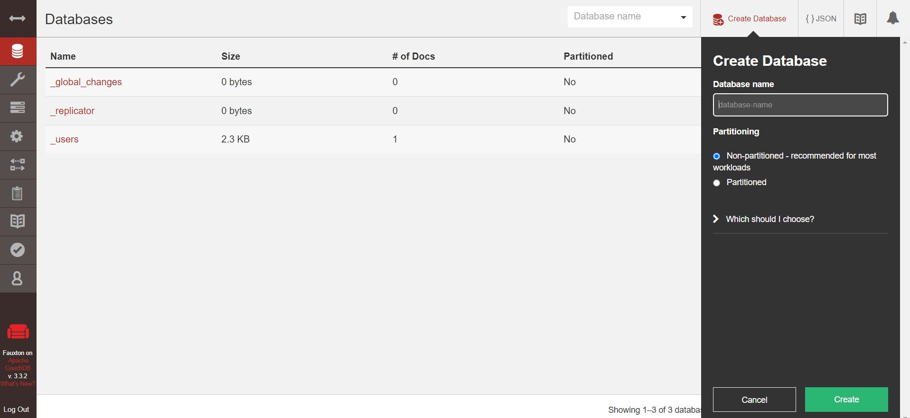
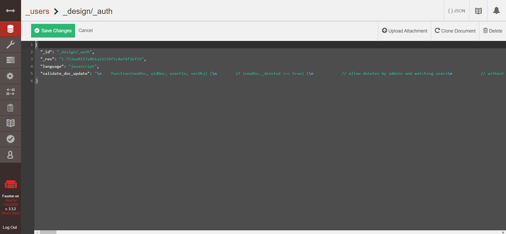
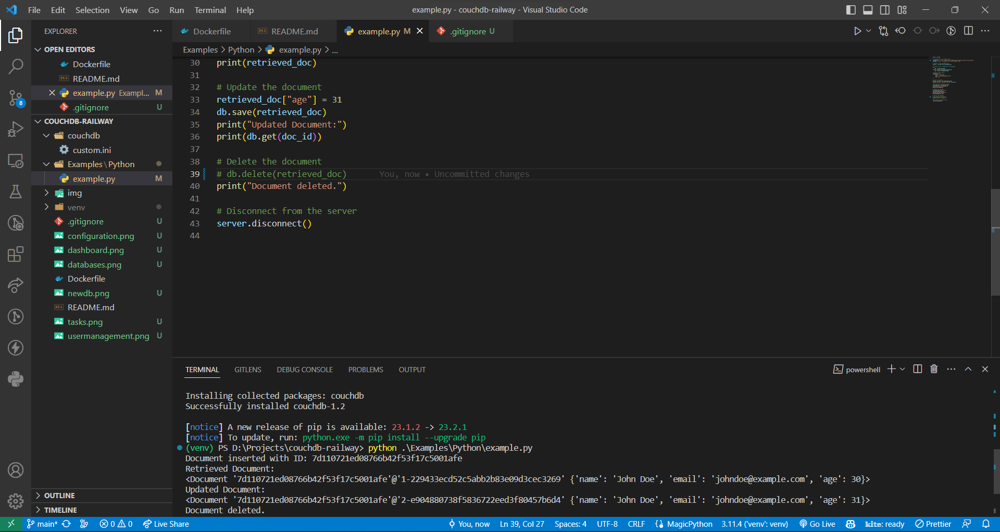
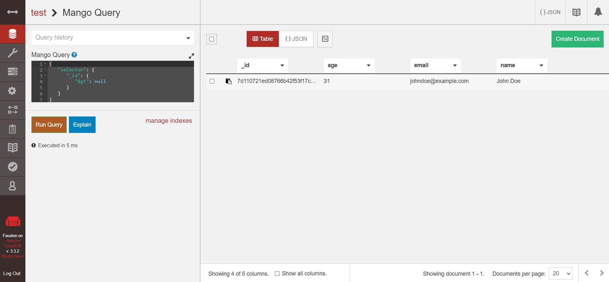
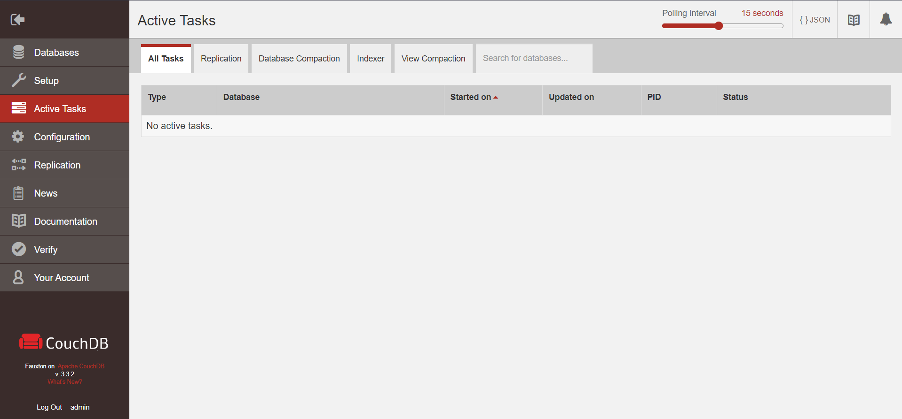
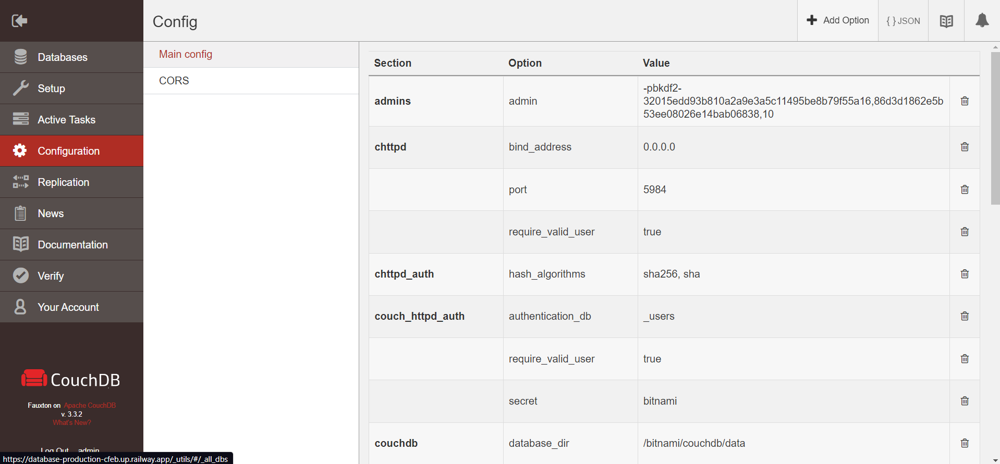
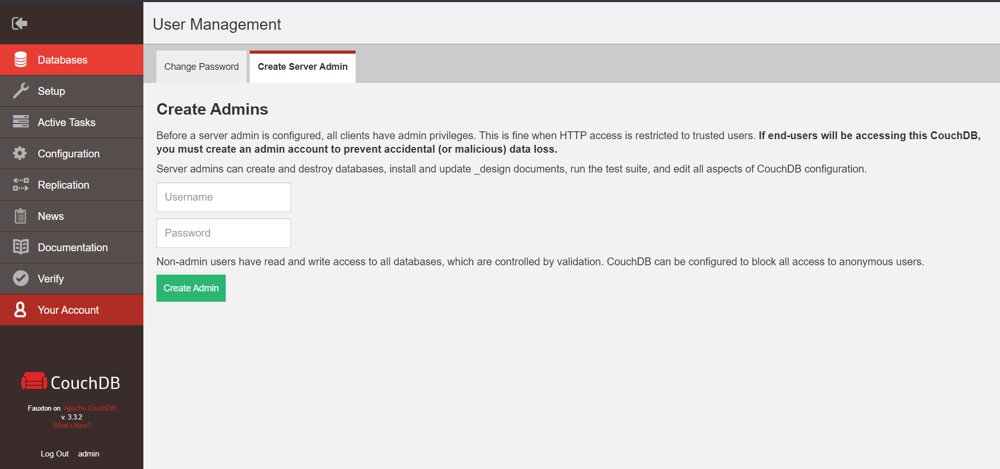

# CouchDB - Railway Template

This example deploys a self-hosted version of [CouchDB](https://couchdb.apache.org/). 

## What is CouchDB?
CouchDB is an open source NoSQL database that stores your data with JSON documents, which you can access via HTTP. It allows you to index, combine, and transform your documents with JavaScript.

## Why use CouchDB?
Apache CouchDB ™ lets you access your data where you need it. The Couch Replication Protocol is implemented in a variety of projects and products that span every imaginable computing environment from globally distributed server-clusters, over mobile phones to web browsers.

Store your data safely, on your own servers, or with any leading cloud provider. Your web- and native applications love CouchDB, because it speaks JSON natively and supports binary data for all your data storage needs.

The Couch Replication Protocol lets your data flow seamlessly between server clusters to mobile phones and web browsers, enabling a compelling offline-first user-experience while maintaining high performance and strong reliability. CouchDB comes with a developer-friendly query language, and optionally MapReduce for simple, efficient, and comprehensive data retrieval.

[Learn more](https://couchdb.apache.org/)

## ✨ Services

- CouchDB

## 💁‍♀️ How to use

- Click the Railway button 👆
- Add the required environment variables to your Railway project
- If you need to make any changes to the configuration, edit `custom.ini` in the `couchdb` folder and commit the changes
- If you need Add your application, then make sure to create a folder and copy the file inside Docker with all dependencies installed. Check `Dockerfile` for more details
- To Expose CouchDB in different ports, Add a new environment variable `COUCHDB_CLUSTER_PORT_NUMBER` and set the value to the port number you want to expose. Update the `PORT` value in railway to the same port number.
- Deploy
- Visit the public URL from Railway to access CouchDB
- You can access the CouchDB Web UI by opening your web browser and navigating to Railway's public URL with path `_utils` something like this `https://<project-name>.up.railway.app/_utils/`. You should be able to see the CouchDB Dashboard.

- To Create new database click on `Create Database` and enter the database name and click on `Create`

- To view the database click on the database name from the list of databases on dashboard. You can view any document by clicking on the document id.

- You can connect your client application to CouchDB and create databases. Refer to the [Examples](Examples/Python/example.py) for python code to connect to CouchDB and perform CRUD operations.

- CouchDB also has options to write custom queries from Dashboard

- From dashboard you can nagivate to tasks to view and manage the tasks

- Dashboard also has configuration settings where you can change the configuration of CouchDB

- You can also manager users from dashboard

- For more information on CouchDB refer to the [Documentation](https://docs.couchdb.org/en/)
- Enjoy! 🎉

## 📝 Notes

- Source repo: https://github.com/apache/couchdb
- Docs: https://docs.couchdb.org/en/stable/
- Docker Image: https://hub.docker.com/r/bitnami/couchdb